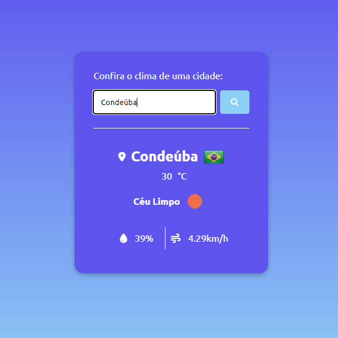

<h1 align="center">🌥️ Clima Agora </h1>

Web APP utilizando api do OpenWeather, fornecendo informações do clima de cidades em tempo real.   

 

  

## 🚀 Tecnologias

Esse projeto foi desenvolvido com as seguintes tecnologias:

- HTML e CSS
- JavaScript
- Git e Github
